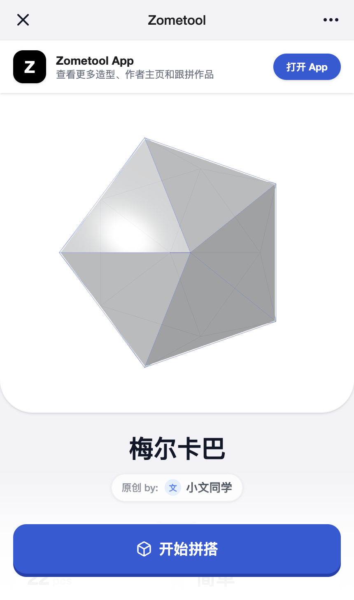
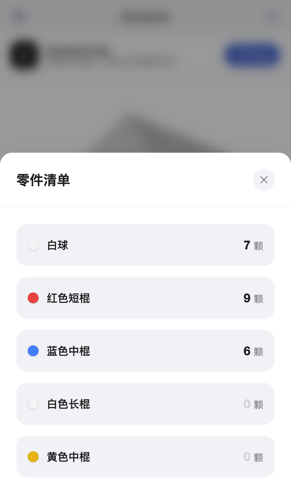
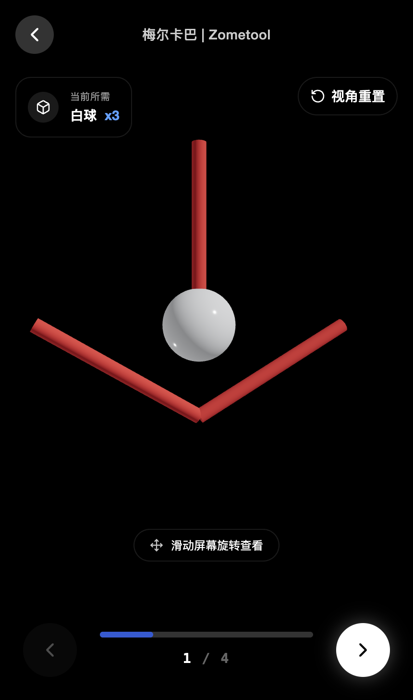

# Zometool App 造型分享 H5 功能迭代 PRD

## 1. 文档说明

- 文档对象：Zometool App 造型分享 H5 功能迭代
- 参考版本：当前在线预览版
- 文档目的：用于产品、设计、研发、测试对齐需求范围、页面结构、交互逻辑与边界处理规则
- 文档说明：本文档聚焦功能需求与业务规则，不展开视觉规范和设计资产细节

---

## 2. 需求背景

Zometool 造型内容、作者内容与拼搭体验主要沉淀在 App 内，但在微信等站外分享场景中，当前缺少一个能够承接单个造型传播的有效页面。

现状问题主要体现在：

1. 站外用户无法快速理解当前造型的核心价值
2. 作者价值与原创身份难以在分享链路中体现
3. 拼搭过程无法被完整感知，用户难以形成兴趣
4. 站外兴趣无法顺畅回流至 App，转化链路偏弱

因此，本次需求不是新建独立项目，而是基于现有 Zometool App 的一次功能迭代：补齐单个造型在站外分享场景下的承接能力。通过新增竖屏 H5 分享页，让用户在不安装 App 的前提下完成一次轻量但完整的造型体验，再通过关键节点引导进入 App。

---

## 3. 产品目标

### 3.1 核心目标

1. 承接单个造型的站外分享访问
2. 让用户快速理解当前造型、作者信息、基础信息和拼搭价值
3. 通过拼搭浏览与相关推荐增强用户兴趣
4. 在浏览关键节点将用户有效转化到 Zometool App

### 3.2 次级目标

1. 给原创作者提供站外曝光
2. 让用户感知平台内还有更多造型与社区内容
3. 降低新用户首次了解 Zometool 的门槛

---

## 4. 目标用户

### 4.1 主要用户

- 通过微信分享链接进入的站外用户
- 对几何造型、拼搭过程、创意作品感兴趣的潜在用户

### 4.2 次要用户

- 分享该造型的作者本人
- 作者的朋友、同学、家长等传播对象
- 已在使用 Zometool，希望把作品传播到站外的人群

---

## 5. 使用场景

1. 用户在微信群、好友聊天或朋友圈中点击某个造型分享链接
2. 用户进入 H5 后先浏览当前造型详情
3. 用户被造型本身或作者吸引，继续浏览基础信息与相关推荐
4. 用户点击“开始拼搭”，进入当前造型的步骤浏览页
5. 用户在完成拼搭浏览后，被更多内容吸引并进入 App

---

## 6. 产品定位

该 H5 不是独立产品，也不是完整造型库的网页版，而是现有 Zometool App 在站外分享链路中的一个新功能模块。

它承担的职责是：

- 完整承载当前造型的详情信息
- 提供当前造型的拼搭浏览体验
- 展示有限的相关推荐内容
- 将更深层的浏览、作者主页和社区能力留在 App 内承接

它不承担的职责是：

- 在 H5 内开放完整造型库
- 在 H5 内开放作者主页
- 在 H5 内开放社区详情、互动或账号能力

---

## 7. 功能范围

### 7.1 本期范围

1. 单个造型详情展示
2. 作者信息展示
3. 基础信息展示
4. 造型说明展示
5. 跟拼作品内容展示
6. 其他热门造型展示
7. 零件清单查看
8. 当前造型拼搭步骤浏览
9. 多处下载 App 引导

### 7.2 非本期范围

1. H5 内完整造型库浏览
2. H5 内作者主页
3. H5 内社区详情页
4. H5 内评论、点赞、收藏、发布等互动能力
5. H5 内搜索、筛选、账号体系
6. H5 内多造型连续浏览

---

## 8. 页面结构与内容方案

### 8.1 页面一：造型详情页

详情页是分享链接的默认落地页，用于承载当前造型的主要信息和相关推荐。

图 8-1 线上 demo 的详情页首屏截图

模块顺序如下：

1. 顶部导航栏
2. 顶部下载 App 引导条
3. 造型主视觉区
4. 造型标题
5. 作者信息
6. 基础信息区
7. 适用套装区
8. 造型说明
9. 跟拼作品
10. 其他热门造型
11. 底部固定“开始拼搭”按钮

设计与内容重点：

- 首屏必须优先展示造型本身
- 作者信息需在较靠前位置展示
- 基础信息用于帮助用户快速理解门槛与套装条件
- 推荐内容负责补充平台内容丰富度
- 底部固定 CTA 需持续可见，但不能完全遮挡底部滚动感知

### 8.2 页面二：零件清单浮层

零件清单不做独立页面，而是通过详情页内入口打开底部浮层。

图 8-2 线上 demo 的零件清单浮层截图

浮层内容包括：

1. 浮层标题
2. 关闭按钮
3. 当前造型所需零件列表
4. 每种零件的名称、颜色或类型、数量

### 8.3 页面三：拼搭页

拼搭页用于承载当前造型的步骤浏览体验，重点是“看懂当前造型如何拼起来”，而不是详细说明文档页。

图 8-3 线上 demo 的拼搭页截图

拼搭页结构如下：

1. 顶部返回栏
2. 当前步骤所需零件提示
3. 3D 模型浏览区
4. 交互提示
5. 底部步骤进度区
6. 上一步 / 下一步切换按钮

### 8.4 页面四：拼搭完成收口层

完成收口层在用户浏览完最后一步后出现，用于结束当前造型体验并引导回 App。

图 8-4 线上 demo 的拼搭完成收口层截图

收口层内容包括：

1. 当前造型已完成的状态提示
2. 更多造型或更多内容仍需进入 App 的文案
3. 下载 App 操作
4. 重新浏览当前造型操作

---

## 9. 详情页功能需求

### 9.1 顶部导航栏

- 页面顶部展示简洁导航栏
- 包含关闭 / 返回语义入口与更多操作占位
- 主要用于强化 H5 页面独立性和基础导航感知
- 当前版本中，更多操作不承载复杂功能

### 9.2 下载 App 顶部引导条

- 页面顶部需提供固定的 App 引导入口
- 展示 App 名称与简短价值说明
- 点击“打开 App”后，触发打开 App / 下载 App 承接动作
- 该入口作为全程最稳定的下载触点

### 9.3 造型主视觉展示区

- 展示当前造型的核心内容
- 支持用户直接观看模型效果
- 以当前造型为详情页首要浏览内容
- 不增加过多干扰性操作，避免误触

### 9.4 造型标题

- 展示当前造型名称
- 位于主视觉展示区之后
- 用于帮助用户快速识别当前内容主题

### 9.5 作者信息

- 展示当前造型作者信息
- 明确该造型为原创作品
- 作者信息不在 H5 内展开更多内容
- 作者相关点击统一引导到 App
- 作者模块同时承担内容归属说明与作者曝光价值

### 9.6 基础信息区

基础信息区至少包含以下字段：

1. 零件总数
2. 拼搭难度
3. 适用套装

其中：

- 零件总数用于帮助用户快速判断材料规模
- 拼搭难度用于帮助用户判断上手成本
- 适用套装用于帮助用户判断是否具备拼搭条件

### 9.7 零件清单

- 用户可通过入口查看零件清单
- 零件清单以浮层形式展示
- 清单中展示零件名称与数量
- 浮层内部支持独立滚动
- 该能力仅用于查看当前造型所需零件，不承担购买或配件推荐职责

### 9.8 造型说明

- 展示当前造型的背景说明或内容介绍
- 用于帮助用户理解作品特点、造型结构或创作亮点
- 若文案较长，需支持默认折叠与展开查看

### 9.9 跟拼作品

- 展示其他用户围绕当前造型产生的相关作品
- 每个作品项至少包含：
  - 作品图
  - 作品名称
  - 作者名称
  - 点赞数
- 点击单个作品时，不在 H5 内展开详情，统一引导到 App
- 点击“查看更多”时，也统一引导到 App

### 9.10 其他热门造型

- 展示平台内其他热门造型，帮助用户感知内容丰富度
- 每个造型项至少包含：
  - 造型图或造型预览
  - 造型名称
  - 零件数量
- 点击单个造型时，不在 H5 内继续展开，统一引导到 App
- 点击“查看更多”时，也统一引导到 App

### 9.11 底部固定开始拼搭入口

- 详情页底部固定展示“开始拼搭”按钮
- 用户点击后进入拼搭页
- 该按钮在详情页浏览过程中始终可见
- 底部区域需要保留用户对下方仍有内容可继续浏览的感知
- 按钮本身需保持高识别度，按钮下方底部区域使用渐变遮罩辅助滚动暗示

---

## 10. 拼搭页功能需求

### 10.1 页面进入方式

- 用户点击详情页底部“开始拼搭”按钮后进入拼搭页
- 进入时默认从第 1 步开始
- 返回详情页时需保留原浏览位置

### 10.2 当前零件提示

- 页面顶部展示当前步骤所需零件信息
- 至少包含零件名称和数量
- 用于帮助用户快速理解当前步骤重点

### 10.3 3D 展示区

- 页面中部展示当前步骤对应的模型内容
- 用户可以对模型进行查看
- 首次进入时提供轻量交互提示，帮助用户理解可旋转查看
- 提供视角重置入口

### 10.4 步骤浏览

- 用户可逐步浏览当前造型的完整拼搭过程
- 支持上一步与下一步切换
- 中部需展示当前总进度
- 当前步骤序号、进度条和零件提示需随步骤同步变化
- 当用户浏览到最后一步后，下一动作进入完成收口状态

### 10.5 完成收口层

- 当用户浏览完当前造型全部步骤后，展示完成引导层
- 告知用户当前造型体验已结束
- 呈现更多内容仍需进入 App 的信息
- 提供以下操作：
  1. 下载 App
  2. 重新浏览当前造型

---

## 11. 交互逻辑

### 11.1 页面进入逻辑

1. 用户点击分享链接后，直接进入当前造型详情页
2. 默认落点为详情页顶部，不增加封面页或额外过渡页
3. 若页面数据加载成功，直接渲染详情内容
4. 若页面数据加载失败，需展示错误提示与兜底动作

### 11.2 详情页浏览逻辑

1. 页面默认支持上下滚动浏览
2. 顶部下载 App 引导条保持在页面上方可见
3. 底部“开始拼搭”按钮固定在底部
4. 页面内容在滚动时从底部按钮区域下方穿过
5. 底部白色渐变区用于提示用户页面仍可继续向下浏览

### 11.3 下载引导逻辑

所有下载引导统一遵循以下规则：

1. 点击顶部“打开 App”按钮，进入打开 App / 下载 App 承接逻辑
2. 点击作者信息、跟拼作品卡片、热门造型卡片、“查看更多”等入口，不在 H5 内打开新详情，而是统一触发下载引导
3. 下载引导优先尝试唤起 App
4. 若唤起失败，则进入应用商店或下载页

### 11.4 零件清单浮层逻辑

1. 用户点击零件清单入口后，打开底部浮层
2. 浮层打开后，背景详情页不发生页面跳转
3. 用户可通过以下任一方式关闭浮层：
   - 点击关闭按钮
   - 点击浮层外空白区域
   - 执行系统返回动作
4. 浮层关闭后，返回详情页原滚动位置

### 11.5 开始拼搭逻辑

1. 用户点击“开始拼搭”按钮后，进入拼搭页
2. 进入拼搭页时默认展示第 1 步
3. 进入拼搭页后，详情页滚动位置需被保留
4. 用户关闭拼搭页返回详情页时，回到进入前的详情页位置，而不是回到页面顶部

### 11.6 拼搭步骤切换逻辑

1. 点击下一步，进入下一步骤
2. 点击上一步，返回上一步骤
3. 第 1 步时，“上一步”按钮不可继续向前
4. 最后一步时，“下一步”按钮不再进入新步骤，而是进入完成收口层
5. 切换步骤时，需要同步更新：
   - 当前步骤展示内容
   - 当前所需零件信息
   - 步骤进度条
   - 当前步骤序号

### 11.7 3D 模型查看逻辑

1. 拼搭页默认展示当前步骤模型
2. 用户可通过手势或拖动查看模型
3. 首次进入拼搭页时，展示轻量交互提示
4. 一旦用户完成首次交互，该提示消失
5. 点击视角重置入口后，回到默认视角

### 11.8 完成收口层逻辑

1. 当用户在最后一步继续前进时，打开完成收口层
2. 收口层出现后，当前拼搭页仍作为背景存在
3. 用户点击“下载 App”后进入下载承接逻辑
4. 用户点击“重新浏览”后：
   - 关闭完成收口层
   - 回到第 1 步
   - 重置进度状态

### 11.9 返回与关闭逻辑

1. 在拼搭页点击返回，退出拼搭页并回到详情页
2. 在浮层打开时，优先关闭当前浮层，而不是直接离开页面
3. 所有弹层关闭后，用户回到触发前的上下文位置

---

## 12. 边界情况与处理规则

### 12.1 分享链接异常

- 若分享链接缺少有效造型 ID，页面不展示空白内容
- 需给出“当前分享内容不存在或已失效”的提示
- 提供返回 App 或下载 App 的兜底入口

### 12.2 数据加载失败

- 若请求超时、接口异常或资源加载失败，需展示错误提示
- 页面需提供至少一个可执行动作：
  - 重试
  - 打开 App 查看
- 不允许展示没有提示的空白页面

### 12.3 图片或模型资源加载失败

- 若主视觉、作品图或模型资源加载失败，需显示占位态
- 页面主体结构仍然保留，不因单个资源失败导致页面不可用
- 对于拼搭页，若模型加载失败，至少保留步骤信息、零件信息和返回能力

### 12.4 长文案情况

- 若造型说明文案过长，不应让单段文字无限拉长页面
- 需要支持折叠或限制默认展示高度，再通过“展开”查看完整内容
- 展开后不应打断当前页面上下文

### 12.5 零件清单较长

- 若零件项数量较多，浮层内部应支持独立滚动
- 浮层高度不应超过安全展示区域
- 关闭浮层后，详情页仍回到原浏览位置

### 12.6 跟拼作品或热门造型为空

- 若某一推荐模块无数据，可采用以下规则：
  - 直接隐藏该模块；或
  - 展示轻量空态，但不出现不可点击的伪内容
- 不能因单个推荐模块无数据影响主流程使用

### 12.7 作者信息缺失

- 若作者头像缺失，可使用默认头像占位
- 若作者昵称缺失，应至少保留“原创作者”身份提示
- 作者模块不应因单字段缺失而整体消失

### 12.8 零件数量为 0 或缺失

- 对于数量为 0 的零件项，可展示为置灰态，表示该字段存在但当前不需要
- 若某一步所需零件信息缺失，拼搭页需至少展示当前步骤序号和模型内容

### 12.9 拼搭步骤边界

- 若当前造型只有 1 步：
  - 进入拼搭页后直接展示第 1 步
  - “上一步”不可用
  - 点击“下一步”直接进入完成收口层
- 若拼搭步骤为空，则不应进入正常拼搭页，而应给出提示并引导回详情页或 App

### 12.10 用户中途退出

- 用户在拼搭过程中返回详情页时，不应丢失详情页原滚动位置
- 用户在未完成所有步骤前退出，不弹出强制确认
- 用户再次点击“开始拼搭”时，默认从第 1 步进入，而不是继承上次浏览到的步骤

### 12.11 App 唤起失败

- 点击打开 App 后，若设备上未安装 App 或唤起失败，需自动进入下载页或应用商店
- 不能让用户停留在无反馈状态

---

## 13. 下载 App 引导需求

### 13.1 引导目标

将用户从站外 H5 转化进入 App，承接更完整的内容浏览与社区体验。

### 13.2 触发位置

下载 App 引导至少出现在以下位置：

1. 顶部引导条
2. 作者相关点击
3. 跟拼作品“查看更多”
4. 跟拼作品卡片点击
5. 其他热门造型查看更多
6. 其他热门造型卡片点击
7. 拼搭完成后的收口引导层

### 13.3 承接内容说明

用户进入 App 后应能够继续查看：

1. 更多造型
2. 作者主页
3. 更多跟拼作品
4. 更完整的拼搭与内容生态

---

## 14. 用户主流程

### 14.1 详情浏览主流程

1. 用户打开分享链接
2. 进入单造型详情页
3. 浏览造型信息、作者信息和相关推荐
4. 根据兴趣点击开始拼搭或点击下载 App

### 14.2 拼搭浏览主流程

1. 用户点击开始拼搭
2. 进入拼搭页并从第 1 步开始浏览
3. 用户逐步查看造型拼搭过程
4. 浏览完成后进入收口引导层
5. 用户选择下载 App 或重新浏览

### 14.3 转化流程

1. 用户在详情页或拼搭页触发下载引导
2. 跳转到下载或打开 App 的承接页面
3. 在 App 内继续浏览更多内容

---

## 15. 关键产品规则

1. H5 只完整开放当前一个造型
2. H5 不承载完整内容生态，只承担内容预览与转化
3. 所有“查看更多”类型入口统一由 App 承接
4. 拼搭页支持完整浏览当前造型的所有步骤
5. 最终完成态必须回收到 App 下载引导
6. 浮层关闭、拼搭页退出后均需返回原上下文位置
7. 不允许因单模块数据缺失导致页面整体不可用

---

## 16. 页面所需信息

### 16.1 当前造型信息

- 造型名称
- 主视觉内容
- 造型说明
- 零件总数
- 拼搭难度
- 适用套装

### 16.2 作者信息

- 作者昵称
- 作者头像
- 作者身份标识

### 16.3 零件清单信息

- 零件名称
- 零件颜色或类型
- 对应数量

### 16.4 跟拼作品信息

- 作品名称
- 作品图片
- 作者名称
- 点赞数

### 16.5 热门造型信息

- 造型名称
- 造型预览内容
- 零件数量

### 16.6 拼搭步骤信息

- 当前步骤序号
- 当前步骤展示内容
- 当前所需零件名称
- 当前所需零件数量

---

## 17. 一句话定义

这是一个用于站外传播的单造型分享 H5 功能模块，用户可以完整浏览当前造型的详情和拼搭过程，并在多个关键节点被引导进入 Zometool App 查看更多内容。
